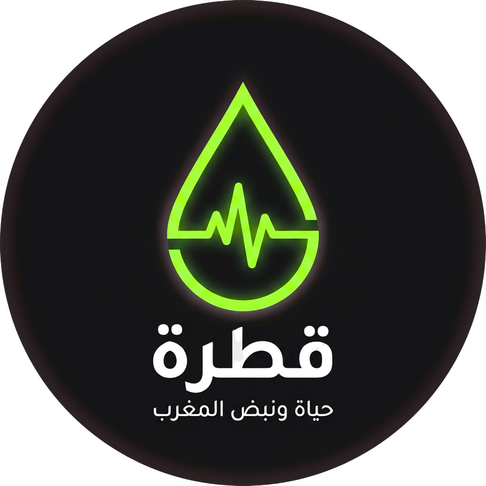

  
  
  

# Anouar BOUDEHBI
### Founder & CEO | Ecosystem Architect & Lead Engineer | Daba App + Qatra App | Scaling Hyperlocal Tech  for Good 💻🚀

 

---

## 👋 من أنا؟
مطور برمجيات ومبتكر حلول تقنية. أعمل على تحويل الأفكار المعقدة إلى منصات رقمية ذكية تخدم المجتمع؛ من اللوجستيات المحلية والتوصيل عبر Daba App، إلى دعم العمل التضامني والصحي عبر Qatra App. أجمع بين الهندسة المعمارية للتطبيقات والذكاء الاصطناعي لبناء حلول محلية قابلة للتوسع.
## 🚀 محفظة المشاريع (Ecosystem)

### 🩸 Qatra App
*نظام متكامل للصحة واللوجستيك التضامني*
- **الرؤية:** إحداث ثورة في الوصول للخدمات الصحية وتسهيل الحياة اليومية.
- **المواقع:** [الرابط الرئيسي](https://qatra.web.app) | [نبذة عن المؤسس](https://qatra.web.app/anouar.html)
- **التقنيات:** `Kotlin` | `Firebase`

### 📍 Daba App
*الجيل الجديد لتوصيل القرب (Hyperlocal Delivery)*
- **الهدف:** بناء شبكة لوجستية رقمية آمنة وذات كفاءة تشغيلية عالية.
- **الموقع:** [dabaapp.web.app](https://dabaapp.web.app)

### 🤖 Visiocode AI Pro
*الوكيل الذكي (Shadow Agent)*
- **الميزة:** استخدام تقنيات الـ Local AI لتحويل الأفكار إلى منتجات رقمية بسرعة البرق.
- **الموقع:** [visiocodeaipro.github.io](https://visiocodeaipro.github.io/visiocode-ai-pro)
- **التقنيات:** `Python` | `CustomTkinter` | `Ollama`

---

## 🛠 التكنولوجيا والمهارات
`Kotlin` • `Python` • `Java` • `Firebase` • `Android Studio` • `Local LLMs` • `Git`

---

📫 **للتواصل والشراكات:**
أنا دائماً منفتح على مناقشة فرص التعاون في المشاريع التقنية والريادية.
- [حسابي الشخصي على فيسبوك](https://web.facebook.com/anwar.boudehbi.1)

---

  
<i>"بناء المستقبل، كوداً تلو الآخر."</i>

  

